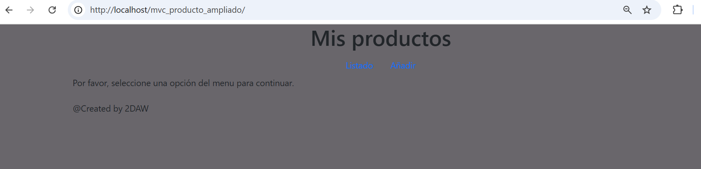
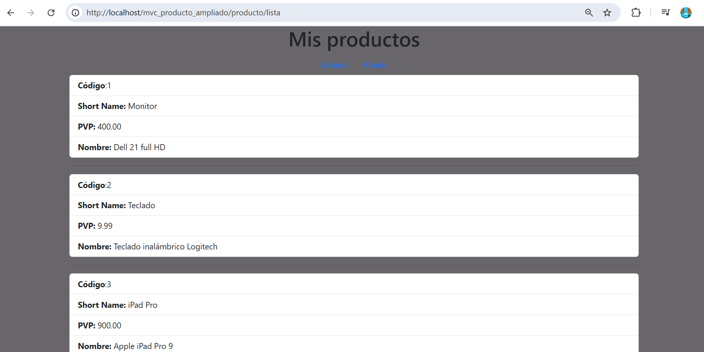
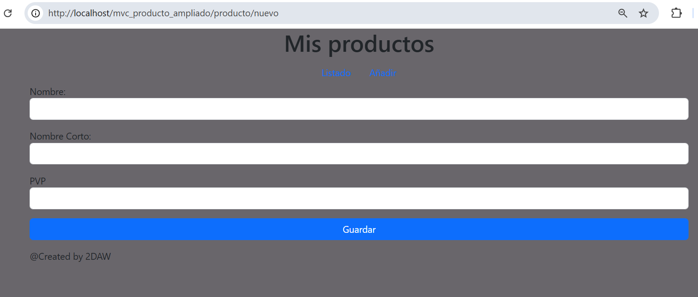

# Aplicación Web MVC para Gestión de Productos

Esta aplicación es una web desarrollada en **PHP** siguiendo el patrón de arquitectura **MVC** (Modelo-Vista-Controlador). Permite listar productos existentes y añadir nuevos productos a una base de datos. El proyecto está pensado para prácticas educativas, con una estructura modular y clara que facilita el mantenimiento y el aprendizaje de buenas prácticas de programación web.

---

## Objetivo del Proyecto

El sistema facilita operaciones CRUD básicas (**Consultar** y **Añadir**) sobre productos. Los usuarios pueden ver un listado de todos los productos y acceder a un formulario para insertar nuevos productos.

Está especialmente diseñado para ser utilizado en entornos educativos, donde se pueden introducir fallos intencionados para que los estudiantes los resuelvan.

---

## Estructura de la Aplicación

- **Modelo (`model/product.php`)**: Define la estructura y gestión de los datos de producto.
- **Vista (`view/`)**: Muestra la información al usuario y gestiona los formularios.
- **Controlador (`controller/`)**: Recibe y procesa las solicitudes, accede al modelo y decide qué vista mostrar.
- **Repositorio (`repository/`)**: Gestiona las operaciones de acceso y manipulación de datos en la base de datos.

Esta organización permite un desarrollo ordenado, escalable y didáctico, ideal para enseñar buenas prácticas de programación web en PHP.

---

## Imágenes de Uso

A continuación se muestran ejemplos de las principales pantallas de la aplicación:

### Pantalla Principal


### Listado de Productos


### Formulario para Añadir Producto


---

## Instalación

1. **Colocar el código en `htdocs`:**
   - Copia toda la carpeta del proyecto en el directorio `htdocs` de tu instalación de XAMPP o similar. Por ejemplo:  
     ```
     C:\xampp\htdocs\mvc_producto_ampliado
     ```
   - Accede en el navegador mediante:  
     ```
     http://localhost/mvc_producto_ampliado/
     ```

2. **Configuración de la base de datos:**
   - Asegúrate de tener una base de datos creada llamada `productos`.
   - Utiliza el siguiente script SQL para crear la tabla de productos y añadir algunos registros iniciales:

     ```sql
     -- Creamos la base de datos 
     CREATE DATABASE productos DEFAULT CHARACTER SET utf8 COLLATE utf8_spanish_ci;
      
     USE productos; 

     CREATE TABLE `products` (
       `cod` int(11) NOT NULL,
       `short_name` varchar(20) NOT NULL,
       `pvp` decimal(5,2) NOT NULL,
       `nombre` varchar(100) NOT NULL
     ) ENGINE=InnoDB DEFAULT CHARSET=latin1;

     INSERT INTO `products` (`cod`, `short_name`, `pvp`, `nombre`) VALUES
     (1, 'Monitor', '400.00', 'Dell 21 full HD'),
     (2, 'Teclado', '9.99', 'Teclado inalámbrico Logitech'),
     (3, 'iPad Pro', '900.00', 'Apple iPad Pro 9');
     ```
   - Configura los datos de acceso a la base de datos en el archivo correspondiente (generalmente en `repository` o en un archivo de configuración).

3. **Accede a la aplicación:**
   - Una vez configurado, accede a la URL mencionada y podrás ver el listado de productos, añadir nuevos y navegar por la interfaz.

---

## Uso

- **Listado:** Muestra todos los productos existentes en la base de datos.
- **Añadir:** Permite crear nuevos productos mediante un formulario sencillo.

El diseño es minimalista y funcional para centrarse en la lógica y el aprendizaje de la arquitectura MVC en PHP.

---

### Créditos

@Created by FEDAL & CGARCHER

---
